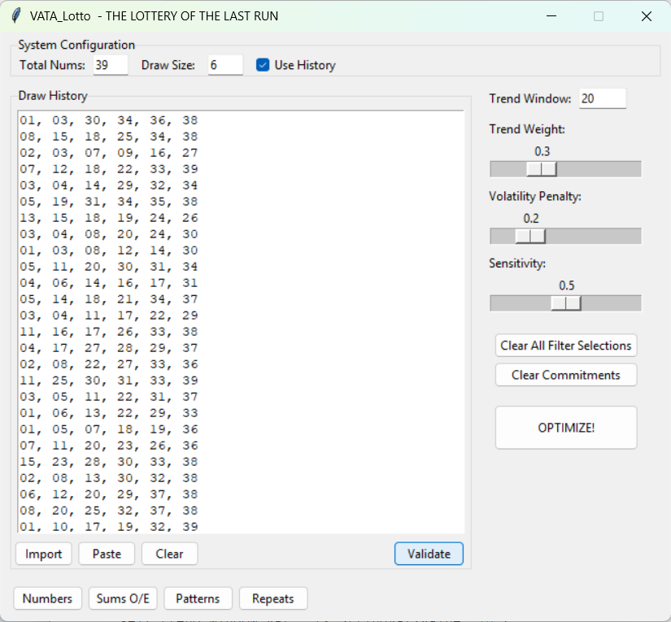
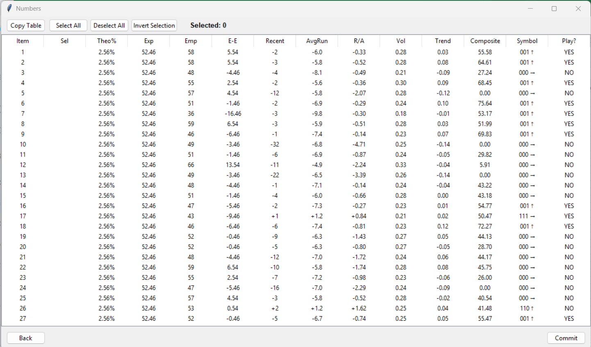
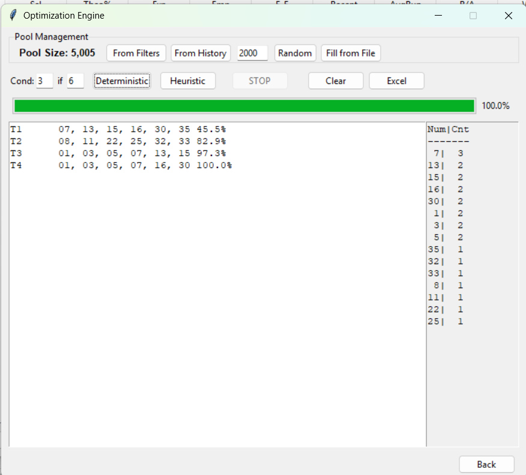
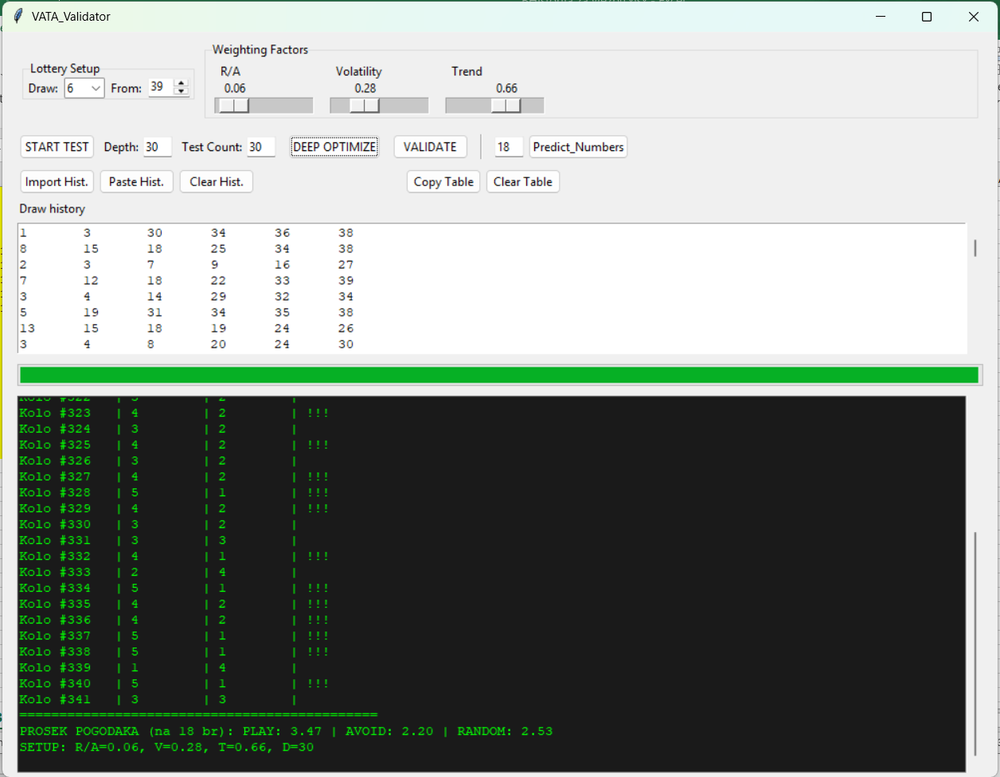
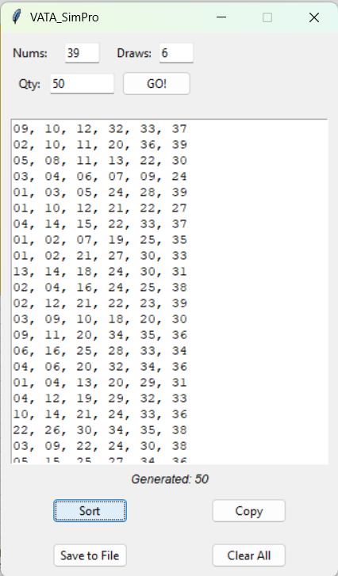

# VATA_Lotto: The Lottery of the Last Run

Welcome to the **VATA_Lotto** ecosystem, a specialized suite of tools designed for lottery trend analysis and strategy testing based on the unique **"Last Run"** (Recent Run) theory.

## 🧠 The Philosophy
Traditional lottery systems often fail because they rely solely on the "Law of Large Numbers." **VATA_Lotto** operates on a different principle: The rhythm of the immediate past. We focus on whether a current streak (Hit or Skip) is likely to **Continue** or **Break** based on its own historical volatility and trend.

## 👤 About the Author & Development
**Author:** Jasminko Arnautovic  
**Location:** Tuzla, Bosnia and Herzegovina

I am the creator of the **"Last Run"** lottery theory. It is important to note that **I am not a professional programmer**. This entire software suite was brought to life by translating my mathematical concepts into Python through an intensive collaborative process with **Google Gemini AI**. 

This project proves that AI can empower domain experts to build sophisticated tools, bridging the gap between complex theory and functional software.

## 🛠️ Included Tools
1. **VATA_Lotto.py**: The main command center for analysis, filtering, and ticket generation.
2. **VATA_Validator.py**: A back-testing engine to find the "Sweet Spot" parameters for any lottery.
3. **VATA_SimPro.py**: A professional simulator for generating synthetic history for any lottery format (6/39, 5/30, 7/42, etc.).

## 📖 Documentation & Setup
For detailed instructions on how to use the app and format your data, please see the:
👉 **[Complete User Guide](UserGuide.md)**

*For testing, you can use the provided sample file:* `BHLotto6_39.txt`.

## 📸 Screenshots

## 📦 Installation
1. Install **Python 3.x**.
2. Download the `.py` files from this repository.
3. **Important:** Run the files by double-clicking them in your folder (avoid running via IDLE to prevent clipboard issues).

## ⚖️ License

Published under the **GNU GPLv3** license. Free for personal use. Commercial use or resale without the author's permission is strictly prohibited.

---

## Support My Work ☕

If you find this project useful and want to support its further development, you can buy me a coffee! Your support helps me dedicate more time to researching lottery mathematics and VATA methodologies.

You can also visit my profile here: [buymeacoffee.com/jasminkotraining](https://buymeacoffee.com/jasminkotraining)
